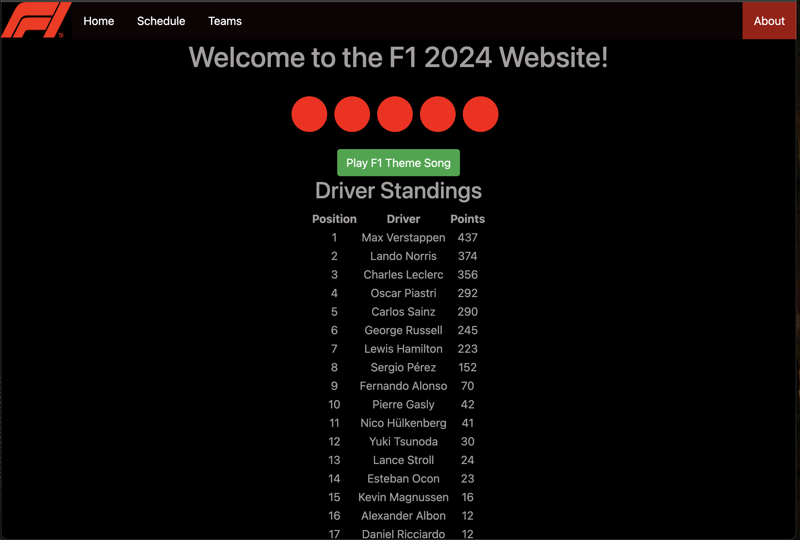
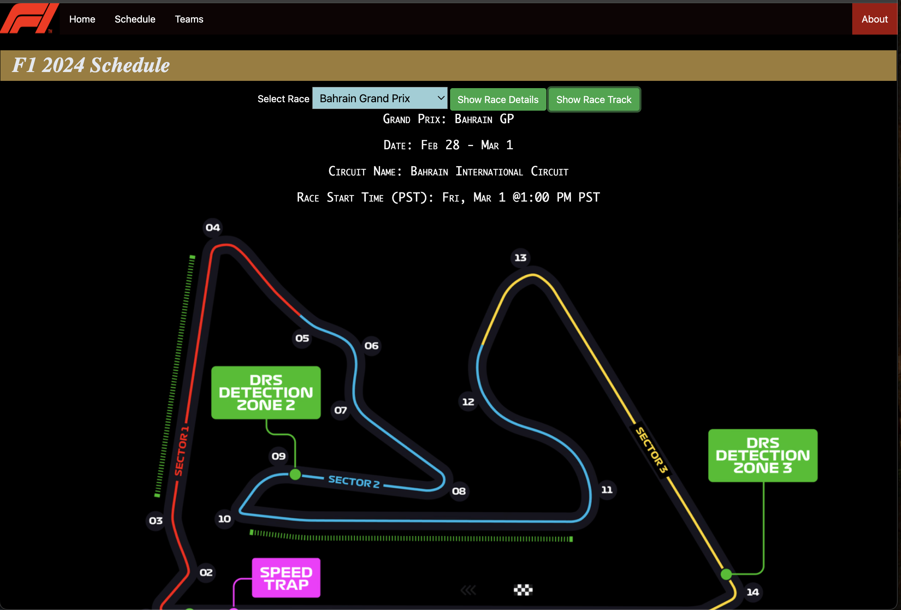
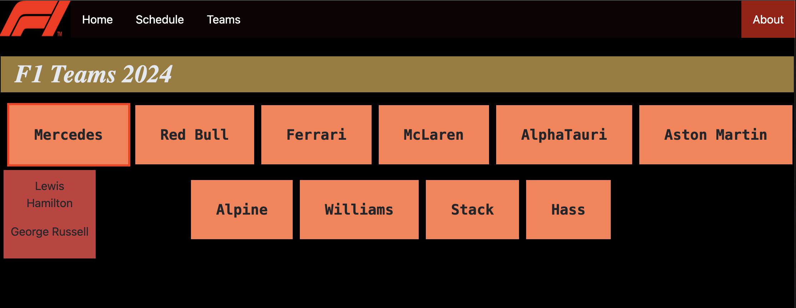

F1 Website for the 2024 Season. Find driver standings, driver lineup for each team, and schedule with race information including start time, location, and race track.
- Drivers standing was retrieved using Ergast API

### Home Page

### Schedule Page

### Team Page
